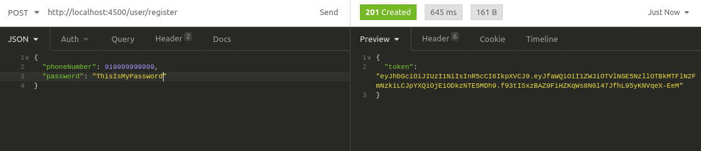
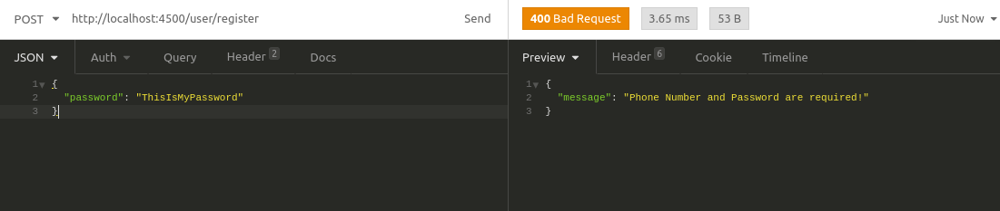
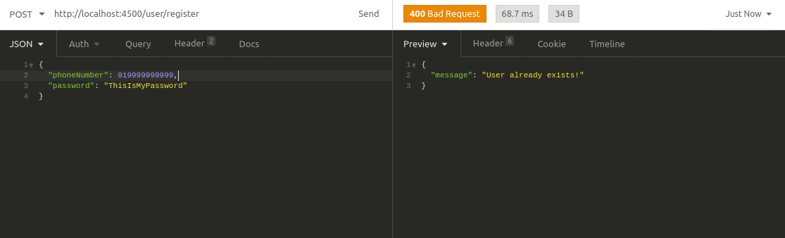
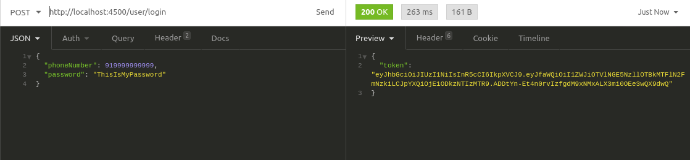
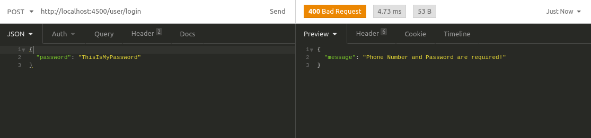
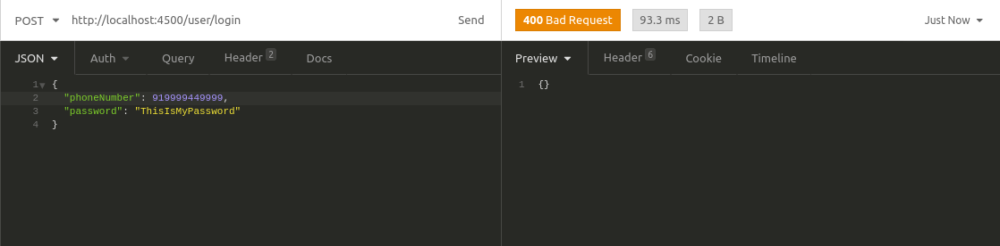
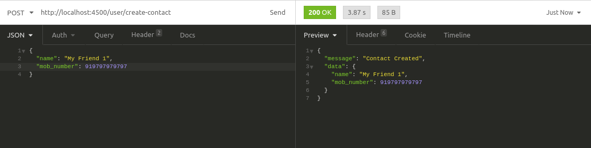
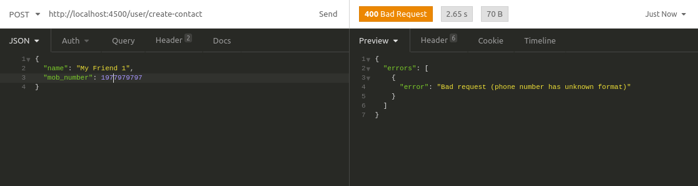

# Bankaks

## Problems Statement(s):

1. Endpoints to register and login a user with JWT token as a response.
2. Endpoint to allow a user to create contacts, the phone number of the contact should be validated before saving it in the database

## Tech Stack used:

1. **Runtime**: NodeJS
2. **Database**: MongoDB
3. **ORM**: Mongoose

## How to run the code?

1. Clone it on the local machine

```bash
git clone repo_url
```

2. Install all the dependencies

```bash
npm install
```

3. Copy the `.env` file in the root of the repository
4. Run the development environment

```bash
npm run dev
```

## Endpoints' functionality and Usage with examples

### 1. POST /user/register

This endpoint is responsible for registering a user. It creates an entry in the database with the User credentials

**Input**

```json
{
  "phoneNumber": 919999999999,
  "password": "ThisIsMyVerySafePassword"
}
```

**Possible Outputs**

1. Success - 201

```json
{
  "token": "xyzdfsndkjfsdjThisIstheTokend"
}
```



2. Bad Request - 400 - malformed payload

```json
{
  "message": "Phone Number and Password are required"
}
```



3. Bad Request - 400 - Account already Exists

```json
{
  "message": "Account already exists"
}
```



### 2. POST /user/login

This endpoint logs a user in by returning JWT token for given login credentials.

**Input**

```json
{
  "phoneNumber": 919999999999,
  "password": "ThisIsMyVerySafePassword"
}
```

**Possible Outputs**

1. Success - 200



2. Bad Request - 400 - Malform Payload



3. Bad Request - 400 - Wrong Login Credentials



### 3. POST /user/create-contact

Creates a contact for a user after validating the phone number using Bird Messaging Lookup API.

**Input**

```json
{
  "name": "My Friend 1",
  "mob_number": 1977979797
}
```

**Possible Outputs**

1. Success - 201



2. Bad Request - 400


